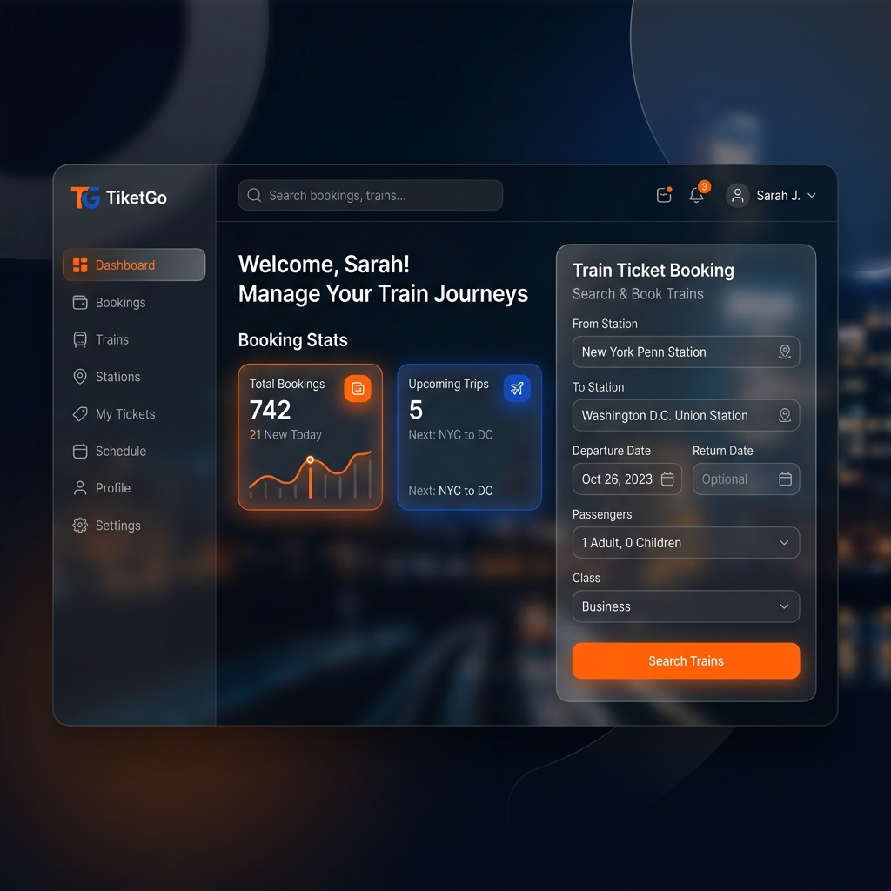

# 🚆 TiketGo



Aplikasi **TiketGo** adalah Sistem Manajemen Kereta Api modern yang berhasil dimigrasi dari platform Java Desktop lawas ke arsitektur web modern menggunakan **Next.js 14**, **Tailwind CSS**, dan **Prisma ORM**.

## ✨ Fitur Utama
- **UI/UX Modern**: Desain *Glassmorphism* dengan skema warna gelap (oranye & biru laut) yang responsif dan memukau.
- **Autentikasi Cepat**: Menggunakan Next.js Server Actions untuk login tanpa jeda.
- **Kasir Cerdas**: Sistem pemesanan tiket dengan perhitungan harga otomatis berdasarkan kelas (VIP, Eksekutif, Bisnis, Ekonomi) serta diskon 50% untuk anak-anak.
- **Manajemen Data (CRUD)**: Mendukung pengelolaan *Data Admin*, *Harga & Kelas*, serta rekam jejak *Penumpang*.
- **Database Skala Enterprise**: Didukung penuh oleh **PostgreSQL** yang andal dan aman.

## 🛠️ Stack Teknologi
- **Frontend**: Next.js 14 (App Router), React, Tailwind CSS
- **Backend**: Node.js, Next.js Server Actions
- **Database**: PostgreSQL
- **ORM**: Prisma 7

## 🚀 Cara Menjalankan di Lokal

1. Clone repositori ini:
   ```bash
   git clone https://github.com/Asoyydeh/TiketGo.git
   cd TiketGo
   ```

2. Instalasi dependensi:
   ```bash
   npm install
   ```

3. Setup Database & Prisma (pastikan PostgreSQL berjalan):
   ```bash
   # Sesuaikan DATABASE_URL di .env
   npx prisma db push
   npx prisma generate
   ```

4. Jalankan Server:
   ```bash
   npm run dev
   ```

5. Buka `http://localhost:3000` di browser dan masuk dengan akun admin bawaan (`admin` / `admin`).

---
Dibuat dengan ❤️ untuk merevolusi manajemen transportasi.
